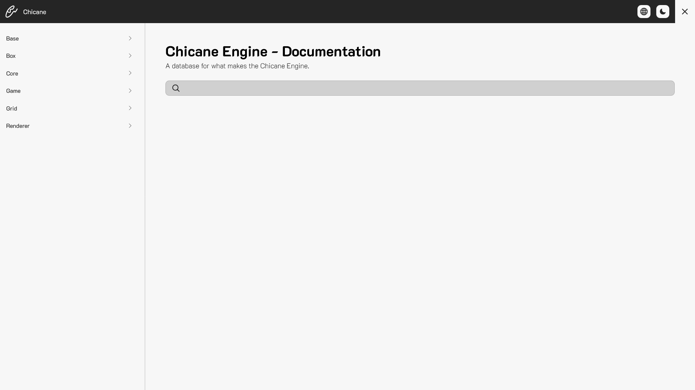

[](https://chicane.erickcaldeira.com)

# chicane-doc

### tl;dr

```
git clone https://github.com/pepeien/chicane-doc.git
cd chicane-doc/
npm install
npm run dev
```

Then open [http://localhost:3000/](http://localhost:3000/) to see your app. The initial structure of your app is setup. You may need to add a few `.env` variables read **Adding environment variables** for more.

### Adding environment variables

|  Variable  | Description                       |  Type   | Required |
| :--------: | :-------------------------------  | :-----: | :------: |
| FETCH_REVALIDATION_INTERVAL  | Revalidation interval in seconds | String |    ✅    |
| TWITTER_HANDLE               | Twitter handle                   | String |    ✅    |
| BLOB                         | App data BLOB                    | String |    ✅    |

### Localization

Locales supported by the application:

- `en-us`;
- `ja-jp`;
- `pt-br`.

### Blob

This is the Blob structure

#### References

- Files following a tree structure should be placed inside `{BLOB}/references` and follow this template:

```json
[
    {
        "title": {REFRENCE_TITLE} [string],
        "filename": {REFRENCE_FILE_NAME} [string],
        "path": {REFRENCE_PATH} [string],
        "source": {
            "header": {REFRENCE_HEADER_SOURCE} [string],
            "namespace": {REFRENCE_NAMESPACE_SOURCE} [string],
            "types": {REFRENCE_TYPES_SOURCE} [ReferenceType[]] - OPTIONAL,
            "enums": {REFRENCE_ENUMS_SOURCE} [ReferenceEnum[]] - OPTIONAL,
            "constructors": {REFRENCE_CONSTRUCTORS_SOURCE} [ReferenceFunction[]] - OPTIONAL,
            "destructors": {REFRENCE_DESTRUCTORS_SOURCE} [ReferenceFunction[]] - OPTIONAL,,
            "functions": {REFRENCE_FUNCTIONS_SOURCE} [ReferenceFunction[]] - OPTIONAL,,
            "members": {REFRENCE_MEMEBERS_SOURCE} [ReferenceMember[]] - OPTIONAL,
        },
        "children": {REFRENCE_CHILDREN} [Reference[]] - OPTIONAL
    }
]
```

- Also a file named `index.json` should exist as a entry point, productions files can be found at the [engine](https://github.com/pepeien/chicane) repository.

Now you are ready to use the project, just issue a `npm run dev` and you're good to go

## About the Project

This project is related to the [Chicane](https://github.com/pepeien/chicane) graphics engine, documentation.

## Development

Install dependencies:

```sh
npm install
```

```sh
npm run dev
```
